# Character Creator

A step-by-step character creator for **Foundry VTT** and the **dnd5e** system. Players build a level 1
character from the content their GM allows — species, class, background, ability scores, choices, equipment,
spells, details and a portrait — and the GM's browser creates it. Works with both the 2014 and the 2024 rules.

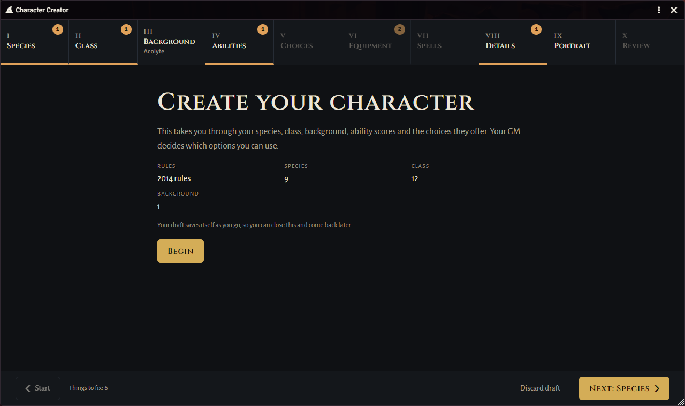

- **Players need no extra permissions.** A Player-role user builds the character in the creator; the finished
  character is created by the GM's browser, checked against the GM's rules, and handed to the player.
- **Nothing is created until it's finished.** The draft is saved as the player goes, so they can close the
  creator and come back later.
- **If no GM is online,** the character waits and is created as soon as one logs in.
- **Uses your content.** It reads the compendiums in your world — dnd5e's SRD, official books you own,
  imported content. No rules content or art is bundled with the module.

## Requirements

| | Minimum | Verified |
|---|---|---|
| Foundry VTT | 14 | 14.365 |
| dnd5e | 5.3.0 | 5.3.3 |

## Installation

In Foundry's setup screen, **Add-on Modules → Install Module**, and paste this manifest URL:

```
https://github.com/tcharlan/character-creator/releases/latest/download/module.json
```

Then enable **Character Creator** in your world (**Game Settings → Manage Modules**).

## For the GM

With the module enabled and nothing else set, players can already create characters from everything in the
world's compendiums. To shape what they may use, open **Game Settings → Configure Settings → Character
Creator**.

### Allowed content

**Choose what players may use** opens one screen for everything the creator offers: species, backgrounds,
classes, subclasses, feats, spells and equipment, which compendiums they come from, and which ways of setting
ability scores are allowed (point buy, standard array, rolled).

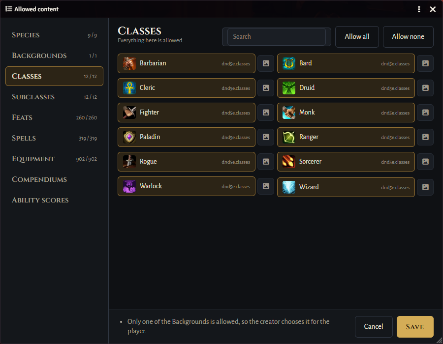

- Tick what's allowed, or use **Allow all** / **Allow none** / **Allow only these** on a filtered list.
- Turning a compendium off hides everything in it, whatever the lists say.
- When only one option (or one ability score method) is left, the creator chooses it for the player; the
  screen warns you when a choice would leave players unable to make a character.
- **Use a picture of your own** sets your own image for a species, class, background or subclass, shown in
  the creator instead of the compendium's. The image must already be in your world's files.

### Other settings

| Setting | What it does |
|---|---|
| Characters per player | How many characters each player may create with the creator. 0 means no limit. |
| Folder for new characters | New characters go into this Actors folder, created if missing. Empty for none. |
| Offer character creation on login | Shows "Create a character" to players without one when they log in. |
| Allow portrait uploads | Lets players upload a portrait. The GM's browser saves it; players need no file permissions. |
| Largest portrait file (MB) | The largest image a player may choose; it is resized to 1024 px before it's sent. |
| Default token ring colors | Used when a player doesn't choose ring colours. Unset means the player's user colour. |

### Pending characters

Characters sent while no GM was online wait for one. When you log in they are created automatically; the
**Pending characters** screen (in the module's settings, and on the Actors tab while anything is waiting)
shows what is waiting, and any the creator refused with the reason, so you can create them again or let the
player fix them.

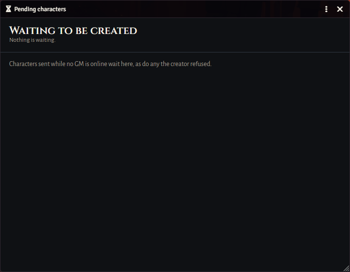

Each new character is checked against your allowed content and the rules before it is created, and the
player's ability score roll, if they rolled, is posted to chat.

## For players

Open the **Actors** tab and press **Create a character** (or answer the prompt when you log in). Work through
the steps in any order; the banner along the top shows what each step still needs.

| | |
|---|---|
| 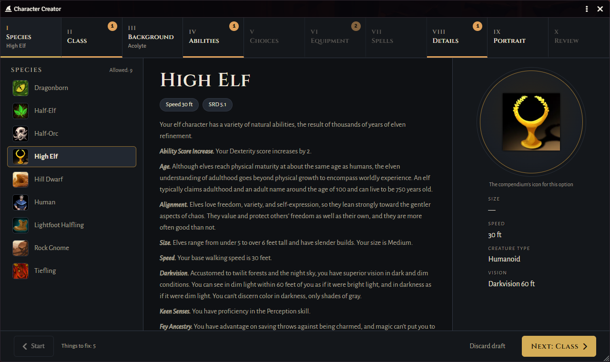 | 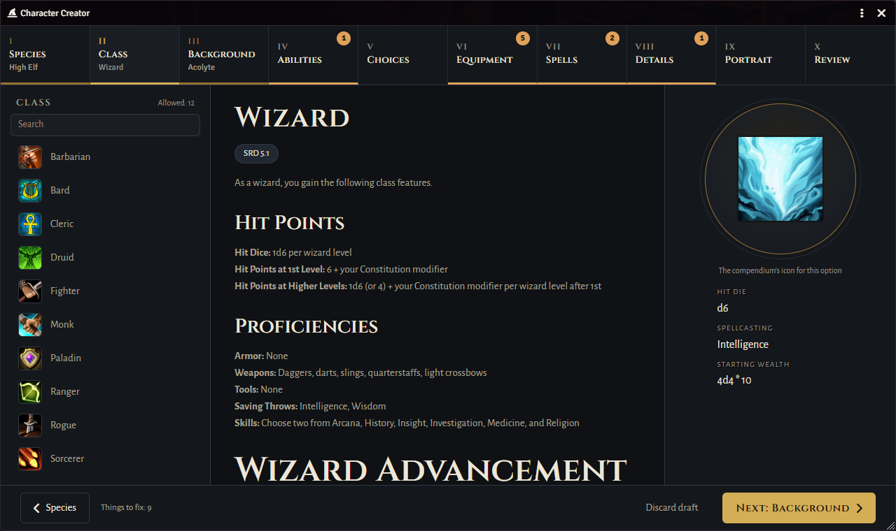 |
| 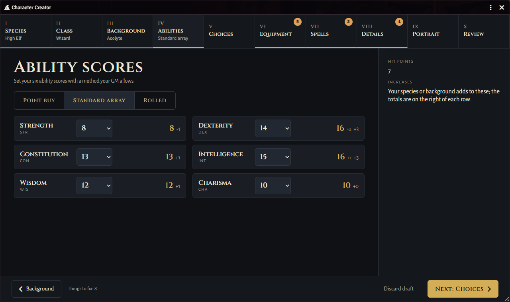 | 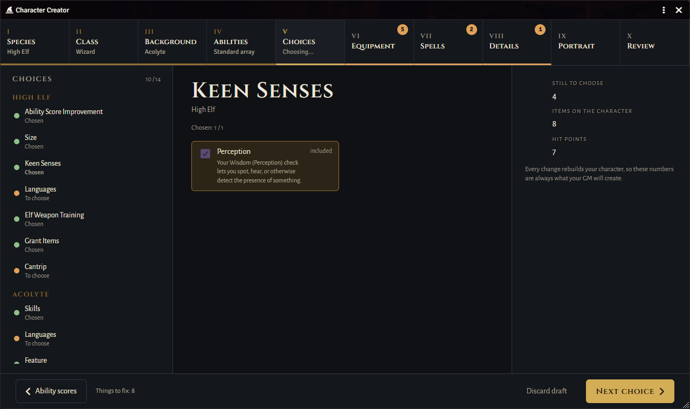 |
| 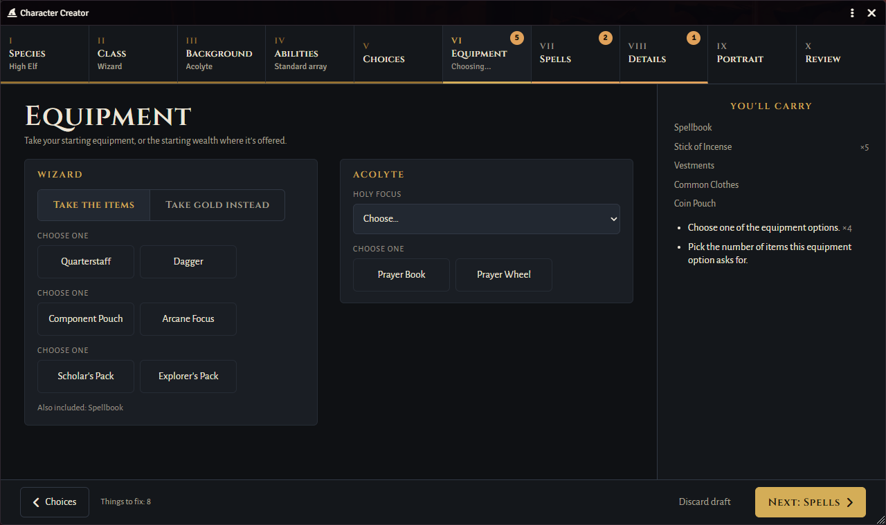 | 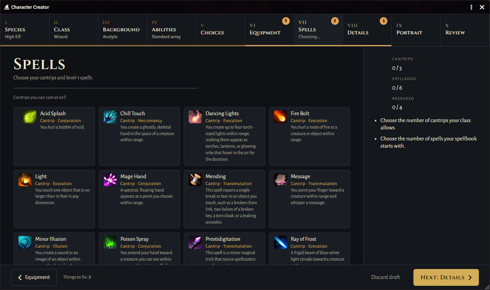 |
| 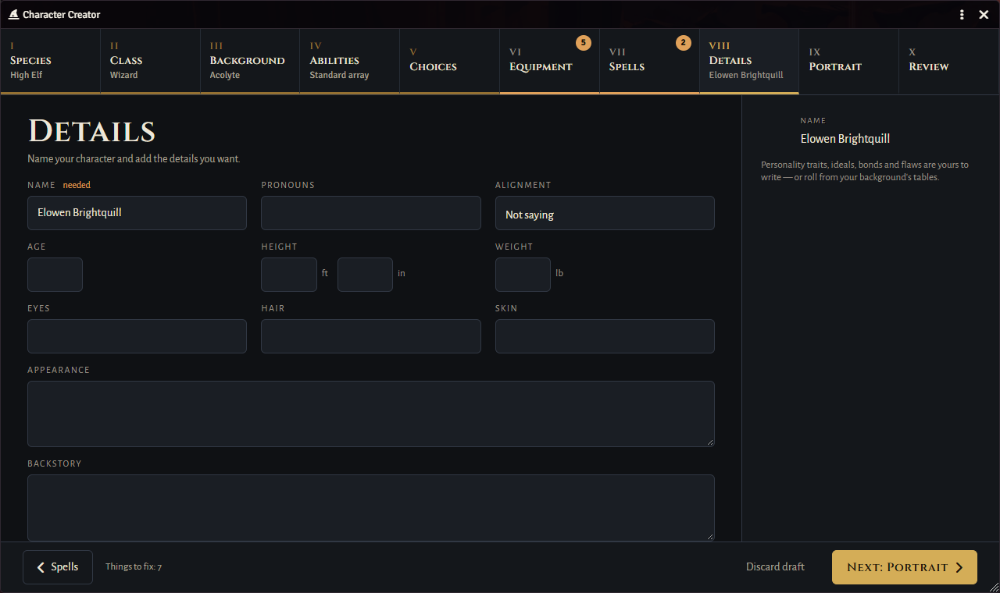 | 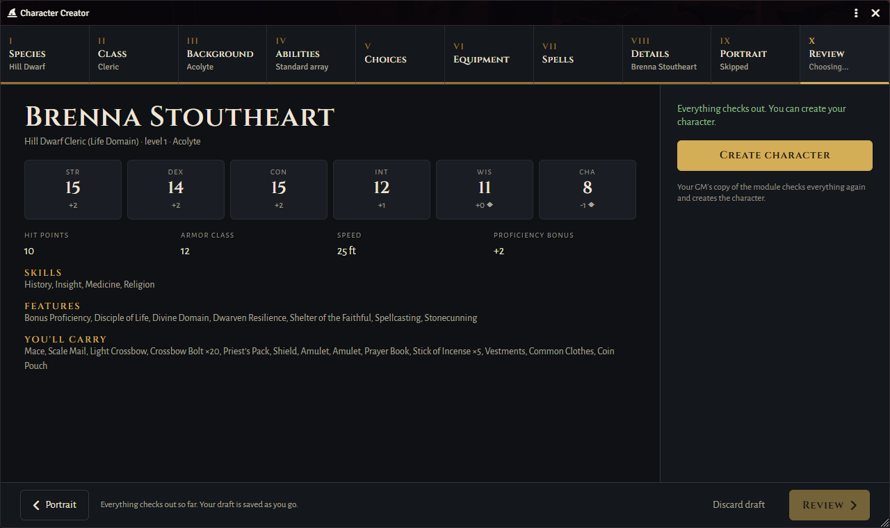 |

When every step is done, **Review** shows the whole character; send it and it appears in your Actors tab,
ready to play. Your draft is kept while you work, so you can close the creator and continue later. If the
GM allows uploads, you can also change your character's portrait later from the character sheet's header.

## Languages

English. Every piece of text is in `lang/en.json`; translations are welcome.

## Licence and credits

MIT — see [LICENSE](LICENSE).

- Fonts: [Cinzel](https://fonts.google.com/specimen/Cinzel) and
  [Alegreya Sans](https://fonts.google.com/specimen/Alegreya+Sans), under the SIL Open Font License
  (`fonts/OFL-*.txt`).
- The screenshots show content from the dnd5e system's SRD compendiums. Character Creator bundles no rules
  content or art of its own.

Found a problem? [Open an issue](https://github.com/tcharlan/character-creator/issues).
